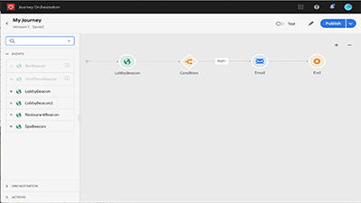

# Vue d’ensemble

[!UICONTROL Journey Orchestration] est un service d’application intégré avec Adobe Experience Platform. Il permet de créer des cas d’utilisation d’orchestration en temps réel à l’aide de données contextuelles stockées dans des événements ou des sources de données.

## Nouveautés

* **[Reporting d’événements d’étape vers Adobe Experience Platform](/help/reporting-step-events-to-adobe-experience-platform.md)**

    
   *Découvrez les événements d’étape du parcours, les étapes de données automatiquement créées sur Experience Platform et comment les explorer.*
* **[Utilisation des événements de qualification de segment](/help/using-segment-qualification-events.md)**

    
   *Cette vidéo présente brièvement comment créer un parcours avec un événement de qualification de segment comme point d’entrée ou de sortie.*

## Sélections du personnel

<table>
<tr>
  <td>
    
    

      <a href="./understanding-journey-orchestration.md">
    <strong>Présentation de Journey Orchestration</strong>
    </a>
    

    

    <em>Découvrez le concept de Journey Orchestration, les types de cas d’utilisation proposés et les éléments essentiels du fonctionnement de ce service.</em>
    

  </td>
  <td>
    
    

      <a href="./create-a-journey.md">
    <strong>Création d’un parcours (vidéo)</strong>
    </a>
    

    

    <em>Découvrez comment créer un parcours, débuter avec un événement, utiliser des commandes d’orchestration pour contrôler le flux et le timing d’un parcours et utiliser des actions pour interagir à différents points du parcours.</em>
    

  </td>
  <td>
   
    

      <a href="./analyze-a-journey-via-reporting-tools.md">
    <strong>Analyse d’un parcours au moyen d’outils de reporting</strong>
    </a>
    

    

    <em>Découvrez comment accéder aux outils de reporting pour votre parcours. Apprenez également comment personnaliser les périodes de votre rapport et comment enregistrer un modèle de rapport en vue d’une utilisation ultérieure. </em>
    

  </td>
</tr>
</table>

## Autres ressources

* [Centre d’aide de Journey Orchestration](https://docs.adobe.com/content/help/fr-FR/journeys/using/journey-orchestration-home.html)
* [Tutoriels Adobe Experience Platform](https://docs.adobe.com/content/help/en/platform-learn/tutorials/overview.html)

